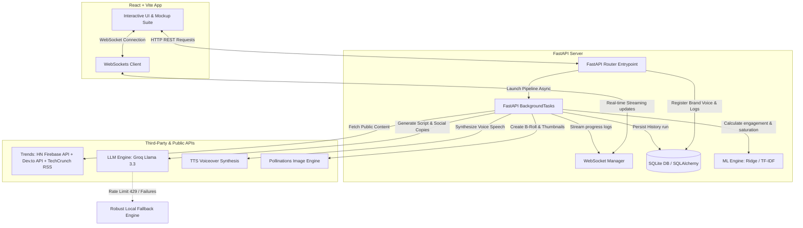

# 📈 Ratefluencer

> **The Ultimate AI-Powered Content Engine for Creators & Brands.** Generate viral video scripts, automatic B-roll video reels with subtitles, synthesized narration, studio thumbnails, professional platform mockups, and real-time virality/oversaturation forecasting from trending tech topics.

---

## 🌟 Key Core Features

*   **⚡ Multi-Source Public Trends Intelligence**: Fetches and ranks live tech & startup topics from **HackerNews**, **Dev.to**, and **TechCrunch RSS** (no API credentials or expensive developer accounts required).
*   **🧠 Fully Asynchronous Background Execution**: Run heavy multi-stage pipelines in the background. Stream progress, logs, and intermediary assets in real time to the frontend using **WebSockets**.
*   **📝 Structured AI Script Studio**: Generates full vertical short-form script blueprints optimized with viral **Hooks**, engaging **Stories**, distinct **Key Insights**, and strong **Call-to-Action (CTA)** guidelines.
*   **🎙️ Synthesized Speech & Waveform Narrator**: Creates high-fidelity synthetic voice narration from script text with an interactive HTML5 custom audio waveform previewer.
*   **🎬 MoviePy Automated Video Assembler**: The backend stitches together AI-generated Pollinations B-roll scenes, synthetic speech audio tracks, and dynamically compiled styled captions into a finalized MP4 video reel ready for download.
*   **🎨 Aspect-Square AI Thumbnail Studio**: Instantly designs clean, high-resolution square 1:1 post-graphics and thumbnails with click-to-download features.
*   **📱 Premium Interactive 3-Column Mockup Suite**:
    *   **Instagram Reels mockup**: 9:16 aspect ratio layout, scrolling profile, interactive subtitle overlays.
    *   **Instagram Feed Post mockup**: Square card with profile header, native 1:1 thumbnail, action bar (like, comment, share, bookmark), and caption.
    *   **LinkedIn Feed Post mockup**: Clean professional card for startup, tech, and corporate creators.
*   **📊 Scikit-Learn Engagement & Saturation Forecaster**:
    *   **Engagement Predictor**: Employs trained scikit-learn `Ridge Regression` models to output detailed views, likes, shares, comments, and saves for both Instagram and LinkedIn.
    *   **Oversaturation Index**: Uses `TfidfVectorizer` and `Cosine Similarity` to compare new topics with past runs and calculate content saturation.
    *   **Flesch-Kincaid Reading Ease Scorer**: Analyzes script readability.
    *   **Sentiment Lexicon Mapping**: Scores sentiment from `-1` (highly negative) to `+1` (highly positive).
    *   **Optimal Posting Time Scheduler**: Dynamically generates optimal posting time schedules based on topic category and velocity class.
*   **🛡️ 100% Graceful LLM Fail-Safes**: Resilient try-except wraps ensure the server never 500s or crashes. If Groq API rate limits (429), token limits, or network quotas are hit, fallback scoring and structured pre-formatted content templates kick in seamlessly.
*   **🚀 Advanced Creator Toolkits (`/pipeline/features`)**:
    *   **A/B Hook Tester**: Generate and test Curiosity Loop, Authority Callout, and Contrarian hooks.
    *   **Brand Voice Persona Engine**: Save and reuse custom creator styles (tone, guidelines, default hashtags) persisted in SQLite.
    *   **AI Weekly Content Calendar**: Generate a full weekly scheduling layout based on the topic.
    *   **Competitor Analyst**: Instantly draft a competitive content brief.
    *   **Repurposing Studio**: Transform vertical short scripts into long-form professional posts.
*   **💾 Multi-Format Export Center**: Download custom SRT timed subtitles, audio files, high-res images, JSON packages, or MP4 videos instantly.

---

## 🏗️ System Architecture & Data Flow

Ratefluencer is engineered as a decoupled, high-performance web application featuring an asynchronous FastAPI Python backend and a React (Vite) frontend.



### Backend Directory Layout
*   **`main.py`**: Entrypoint of the FastAPI app; registers all routers and sets up CORS middleware.
*   **`db.py`**: Configures SQLite database connections using SQLAlchemy.
*   **`models.py`**: Persistent DB schemas:
    *   `ContentHistory`: Tracks every pipeline execution status, progress, script data, assets, and scores.
    *   `BrandVoice`: Persists custom style guides, tones, and default hashtags.
*   **`saved_models/`**: Stores serialized trained `Ridge` estimators for predictive analytics.
*   **`routers/`**: Decoupled REST controllers:
    *   `pipeline.py`: Asynchronous orchestration of the core 10-step AI workflow.
    *   `features.py`: Advanced toolkits (A/B Hooks, Content Calendars, competitor analysis).
    *   `trends.py`: Live trends discovery.
    *   `websocket.py`: Connection setup for push updates.
    *   `export.py`: Multi-format PDF / JSON asset retrieval.
*   **`services/`**: Modular logic microservices:
    *   `ml_engagement_model.py`: Rigorous analytical algorithms and scikit-learn models.
    *   `reddit_service.py`: Aggregator for public HN, Dev.to, and TC RSS sources (compatibility wrapper).
    *   `reel_service.py`: TIMED subtitles, moviepy media stitcher, and pollinations B-roll prompt generator.
    *   `youtube_clips_service.py`: Discovers and embeds YouTube reference videos matching the topic.

---

## 🚀 Quick Start Guide

### Prerequisites
Make sure you have **Python 3.10+** and **Node.js 18+** installed on your machine.

### 1. Clone & Set Up Environment Variables
Create a `.env` file inside the `Backend/` directory:
```env
GROQ_API_KEY=your_groq_api_key_here
```
> [!TIP]
> If you don't have a Groq API key, the pipeline will **gracefully fall back** to the offline local analytical engines. All pages and pipelines will still run flawlessly for demo purposes!

### 2. Launch the Backend Server (FastAPI)
Navigate to the backend directory, configure the virtual environment, install python dependencies, and fire up Uvicorn:
```bash
cd Backend
python -m venv venv
venv\Scripts\activate   # On Windows
# source venv/bin/activate # On macOS/Linux
pip install -r requirements.txt
python -m uvicorn main:app --port 8000 --reload
```
On startup, the backend automatically initializes SQLite database tables (`history.db`) and trains the synthetic engagement forecasting Ridge models if they are not already cached inside `saved_models/`.
*   Interactive API Docs will be available at [http://127.0.0.1:8000/docs](http://127.0.0.1:8000/docs).

### 3. Launch the Frontend Server (Vite)
Navigate to the frontend directory, install npm packages, and spin up the developer bundle:
```bash
cd frontend
npm install
npm run dev
```
Open [http://localhost:5173/](http://localhost:5173/) to launch the workspace!

---

## 🛡️ Reliability & Resiliency
Ratefluencer was designed to survive high-scale usage. If external APIs throttle requests or rate limits (HTTP 429) are reached:
1.  **Trend Ranker** automatically falls back to an engagement-based local relevance algorithm.
2.  **Script Generator** serves customized, structured, topic-focused short script blueprints.
3.  **Social Posts Generator** formats beautiful posts utilizing key script insights.
4.  **Virality Predictor** defaults to specialized local scoring metrics.

All endpoints remain highly available, ensuring frictionless continuous workflow during hackathons and peak product demos.

---

## 🔬 Testing & Validation Scripts
Inside the `Backend/` directory, several robust validation scripts are available for testing core services in isolation:
*   `test_new_sources.py`: Validates the multi-source public trends engine, scraping and ranking feed results from HN, Dev.to, and TechCrunch without authentication. Run via:
    ```bash
    python test_new_sources.py
    ```

---

## 📝 License
This project is open-source and available under the **MIT License**.
